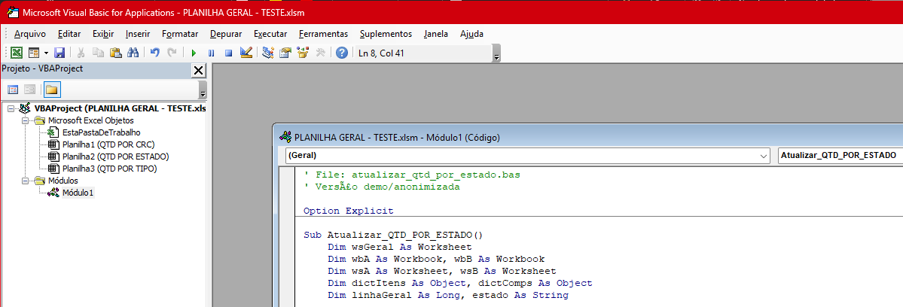
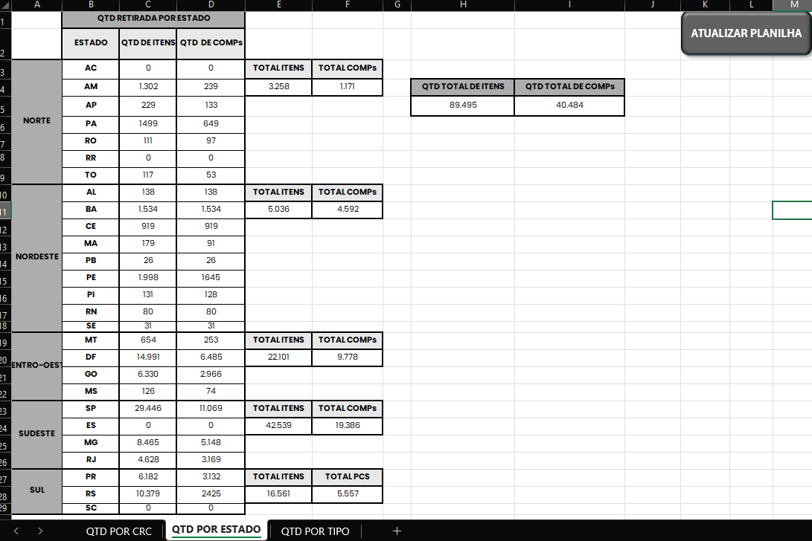

# Automatização de Planilhas Excel - VBA


## Sobre o Projeto

Sistema de automação desenvolvido em VBA (Visual Basic for Applications) para consolidar dados de planilhas de diferentes anos em uma base única. A ferramenta automatiza a interligação e preenchimento de dados, gerando relatórios resumidos com todas as retiradas de lotes empresariais, eliminando o trabalho manual repetitivo e reduzindo significativamente a ocorrência de erros de digitação.

---

## Screenshots

### Visão geral da automação


### Exemplo de Dados


---

## Funcionalidades

- Automação da interligação entre planilhas de diferentes períodos
- Consolidação de dados em base única
- Geração automática de relatórios resumidos
- Soma automatizada de valores entre planilhas
- Redução de trabalho manual e erros de digitação

---

## Tecnologias Utilizadas

| Tecnologia | Descrição |
|------------|-----------|
| Excel | Planilhas, tabelas dinâmicas e base de dados |
| VBA | Automação de processos e geração de relatórios |

---

## Estrutura do Projeto

- excel-automation/
- |
- |--- src/ # Códigos VBA de exemplo
- |--- docs/ # Prints de tela
- |--- exemplos/ # Prints exemplos
- |--- README.md

---

## Como Executar

1. Clone o repositório:
   ```bash
   git clone https://github.com/ProfissionalJV/excel-automation.git
   
2. Habilite macros no Excel
3. Abra os arquivos de exemplo e execute os scripts VBA

---

## Observação
As estruturas reais e originais possuem informações privadas e de uso interno. Os códigos originais foram adaptados exclusivamente para fins de apresentação, documentação e portfólio.

---

## Autor

**Victor Arsego Lêla**

- Desenvolvedor Web e Automatizador de Processos
- Engenharia da Computação - CEUB
- Gestão Pública - Estácio
- [LinkedIn](https://www.linkedin.com/in/vltech/)
